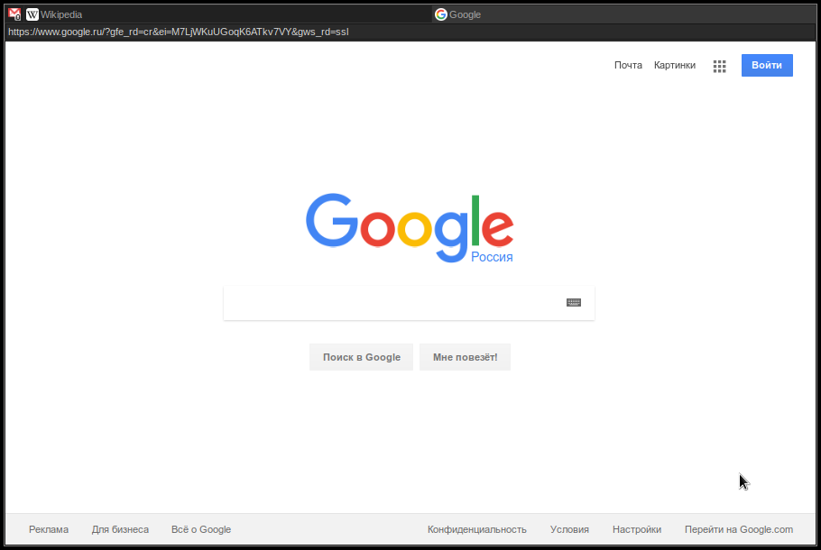

# VegeVoice - lightweight gtk2 webkit browser on Go

# WIP

# Usage

current version supports only hotkeys:

	ctrl + t - open new tab
	ctrl + w - close current tab
	alt + left - history go back
	alt + right - history forward

